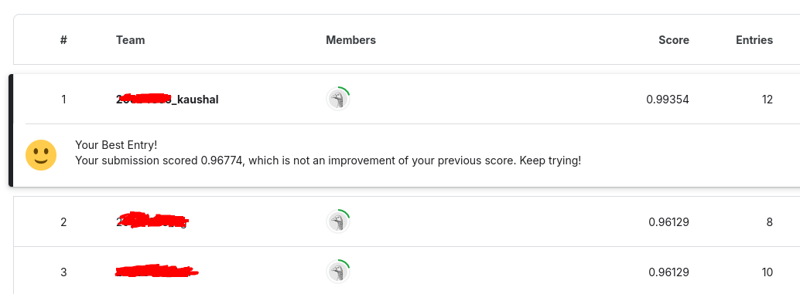

# Project: Transfer Learning for Few-Shot Classification

For this transfer learning project, I used a pretrained **ResNet18** network and **fine-tuned the hyperparameters** for a 
**few shot classification** task. Each class of images only had 5 images per class to train on.

I preprocessed the training data using the following techniques: **resizing** and **normalization**

Notes on **hyper-parameter tuning**:

I found that for this task, a **batch-size** of 8 worked best. My GPU (NVIDIA GTX 1650) couldn't handle anything larger than 32. I used the **cross-entropy** loss function, and **Adam** optimizer. I found that 35 epochs was the sweet spot. To determine an approriate **learning rate**, I printed the training accuracy and loss for each epoch. I started with a learning rate of 0.001 and gradually decreased the LR until the loss was as close to 0 as possible within the timeline of the project.

A single **linear fully connected layer** was sufficient.

With this hyper-parameter tuning, my optimized ResNet18 model performed **best in a Kaggle competition**, with an **accuracy of 99.4%**

**The full project writeup and code can be found in:** ```k3kausha_project_submission``` 

**For other cool neural network related math and code, check out the other folders too!**

